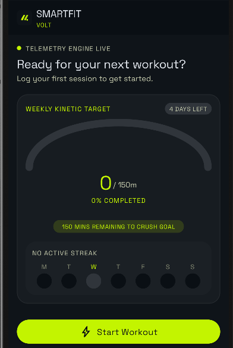
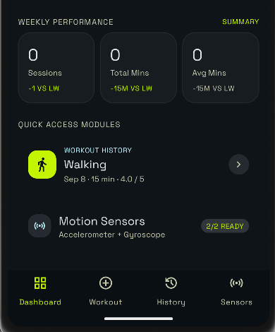
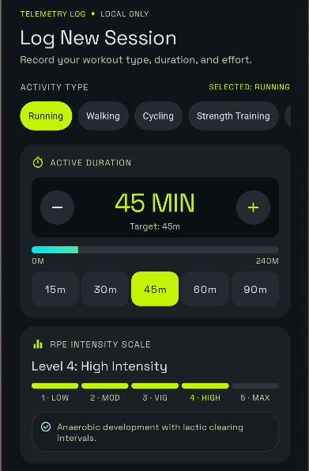
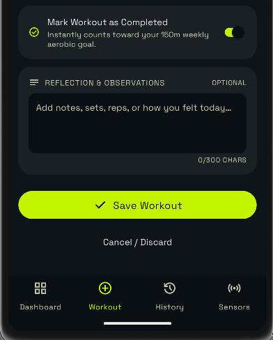
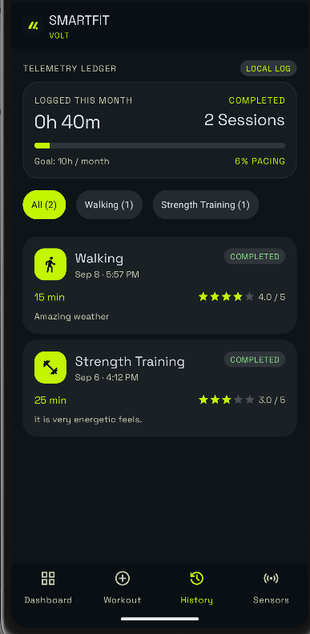
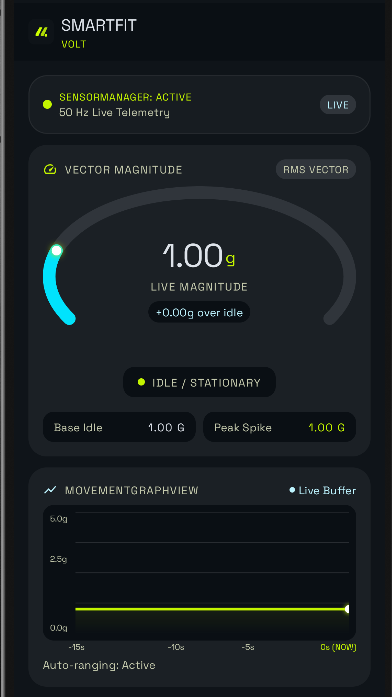
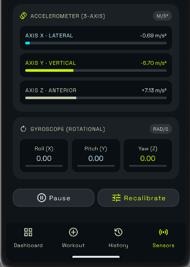

# SmartFit — Android Fitness & Workout Tracker

<p align="center">
  <strong>A native Android fitness tracker for logging workouts, monitoring progress, and visualizing real-time device motion.</strong>
</p>

<p align="center">
  <a href="https://github.com/jenish-28/SmartFit">
    
  </a>
  
  
  
  
</p>

## Overview

**SmartFit** is a native Android fitness and workout tracking application built with Kotlin and traditional Android Views/XML.

The app provides a focused workout experience with local workout logging, progress summaries, workout history, and real-time motion monitoring using the device's **accelerometer and gyroscope**. Workout data is stored locally on the device, so the core application works without a backend or external authentication service.

The interface uses a dark, modern fitness-oriented design with high-contrast lime accents, reusable XML components, custom views, and a persistent bottom navigation system.

## Features

### 🏠 Dashboard
- Weekly **150-minute activity goal** with a live progress gauge.
- Current streak and Monday–Sunday activity overview.
- Week-over-week performance statistics.
- Recent workout preview.
- Motion sensor availability status.
- Quick navigation to workouts, history, and sensors.

### 🏋️ Workout Logging
- Select activity types such as running, walking, cycling, and strength training.
- Adjustable workout duration with `+` / `−` controls.
- Quick duration presets.
- 5-level RPE intensity scale.
- Mark workouts as completed.
- Add optional workout notes with a live character counter.
- Workout data is returned to the dashboard using the Android Activity Result API.

### 📊 Workout History
- RecyclerView-based workout history.
- Newest workouts displayed first.
- Monthly logged-time summary.
- Completed-session count.
- Monthly goal pacing.
- Dynamic activity-type filters.
- Workout rating and notes preview.
- Empty-state handling when no workouts are available.

### 📱 Motion Sensors
- Live **accelerometer X/Y/Z** readings.
- Live **gyroscope X/Y/Z** readings.
- Sensor sample-rate calculation in Hz.
- Movement magnitude displayed in `g`.
- Idle and peak movement tracking.
- Per-axis intensity bars.
- Pause/resume sensor streaming.
- Sensor recalibration.
- Graceful handling when a device does not provide a requested sensor.

### 📈 Custom Visualizations
- Custom real-time movement graph built with `Canvas`, `Paint`, and `Path`.
- Custom radial gauge built with `Canvas`, `Paint`, and `LinearGradient`.
- No third-party charting library is required for the custom motion graph.

## Technology Stack

| Technology | Usage |
|---|---|
| **Kotlin** | Application development |
| **Android Views / XML** | Native UI implementation |
| **AndroidX AppCompat** | Activity and compatibility support |
| **Material Components** | Chips, switches, buttons and Material UI components |
| **View Binding** | Type-safe view access |
| **RecyclerView** | Workout history list |
| **Activity Result API** | Passing workout data between activities |
| **SensorManager** | Accelerometer and gyroscope access |
| **SharedPreferences + JSON** | Local workout persistence |
| **Canvas / Paint / Path / Shader** | Custom graphs and gauges |
| **java.time** | Date, week, month and streak calculations |
| **Gradle Kotlin DSL** | Android build configuration |

## Application Architecture

SmartFit uses a lightweight local architecture centered around Android Activities, reusable views, models, adapters, and a local repository.

```text
SmartFit
│
├── MainActivity
│   └── Dashboard
│
├── WorkoutActivity
│   └── Workout creation
│
├── HistoryActivity
│   └── RecyclerView + workout filtering
│
├── SensorActivity
│   └── Accelerometer + Gyroscope
│       ├── MovementGraphView
│       └── GaugeArcView
│
├── model/
│   └── Workout
│
├── adapter/
│   └── WorkoutAdapter
│
├── storage/
│   ├── WorkoutRepository
│   └── WorkoutStats
│
└── res/
    ├── layout/
    ├── drawable/
    ├── color/
    ├── values/
    ├── font/
    └── menu/
```

## Local Data Storage

Workout records are stored locally using:

```text
SharedPreferences
        ↓
JSON array
        ↓
WorkoutRepository
        ↓
Dashboard / History
```

This keeps the core app simple and allows saved workouts to remain available after restarting the application.

## Android Compatibility

- **Minimum SDK:** 26 — Android 8.0 (Oreo)
- **Target SDK:** 34
- **Compile SDK:** 34
- **JVM target:** Java 17
- **Sensors:** Accelerometer and gyroscope are treated as optional device features.

The project includes the Gradle wrapper, so a separate Gradle installation is not required.

## Screenshots

### Dashboard

<p align="center">
  
  
</p>

### Dashboard — Weekly Performance

<p align="center">
  
</p>

### Add Workout

<p align="center">
  
</p>

### Workout Notes & Save

<p align="center">
  
</p>

### Workout History

<p align="center">
  
</p>

### Sensors

<p align="center">
  
  
</p>


## Getting Started

### Prerequisites

- Android Studio
- JDK 17
- Android SDK Platform 34
- An Android emulator or physical Android device
- Android 8.0 / API 26 or newer

### Run in Android Studio

1. Clone the repository:

```bash
git clone https://github.com/jenish-28/SmartFit.git
```

2. Open the `SmartFit` folder in Android Studio.
3. Allow Gradle to sync and finish downloading dependencies.
4. Start an Android emulator or connect a physical Android device.
5. Select the `app` run configuration.
6. Click **Run ▶**.

### Build from the command line

On macOS/Linux:

```bash
./gradlew clean assembleDebug
```

On Windows:

```bat
gradlew.bat clean assembleDebug
```

The generated debug APK will be available at:

```text
app/build/outputs/apk/debug/app-debug.apk
```

## Project Structure

```text
app/
└── src/
    └── main/
        ├── java/com/example/smartfit/
        │   ├── MainActivity.kt
        │   ├── WorkoutActivity.kt
        │   ├── HistoryActivity.kt
        │   ├── SensorActivity.kt
        │   ├── NavUtils.kt
        │   ├── model/
        │   ├── adapter/
        │   ├── storage/
        │   └── view/
        │
        └── res/
            ├── layout/
            ├── drawable/
            ├── color/
            ├── values/
            ├── font/
            └── menu/
```

## Design Highlights

- Dark, high-contrast fitness interface.
- Lime primary accent with supporting cyan highlights.
- Reusable card, pill, badge, chip, switch, and navigation components.
- Outfit and Space Grotesk typography.
- Custom launcher icon and brand mark.
- Responsive XML layouts for the application screens.

## Core Android Concepts Demonstrated

- Multiple Android Activities.
- Intent extras and Activity Result API.
- Activity lifecycle management.
- RecyclerView and custom ViewHolder.
- Runtime sensor availability checks.
- Sensor lifecycle registration/unregistration.
- SharedPreferences-based local persistence.
- JSON serialization/deserialization.
- Custom `View` drawing.
- Canvas-based real-time visualization.
- View Binding.
- Material Components.
- Gradle Kotlin DSL.

## Repository

**GitHub:** https://github.com/jenish-28/SmartFit

## Author

**Jenish Patel**

GitHub: https://github.com/jenish-28

---

> SmartFit is a native Android application focused on practical workout tracking, local data persistence, and real-time motion sensing.
